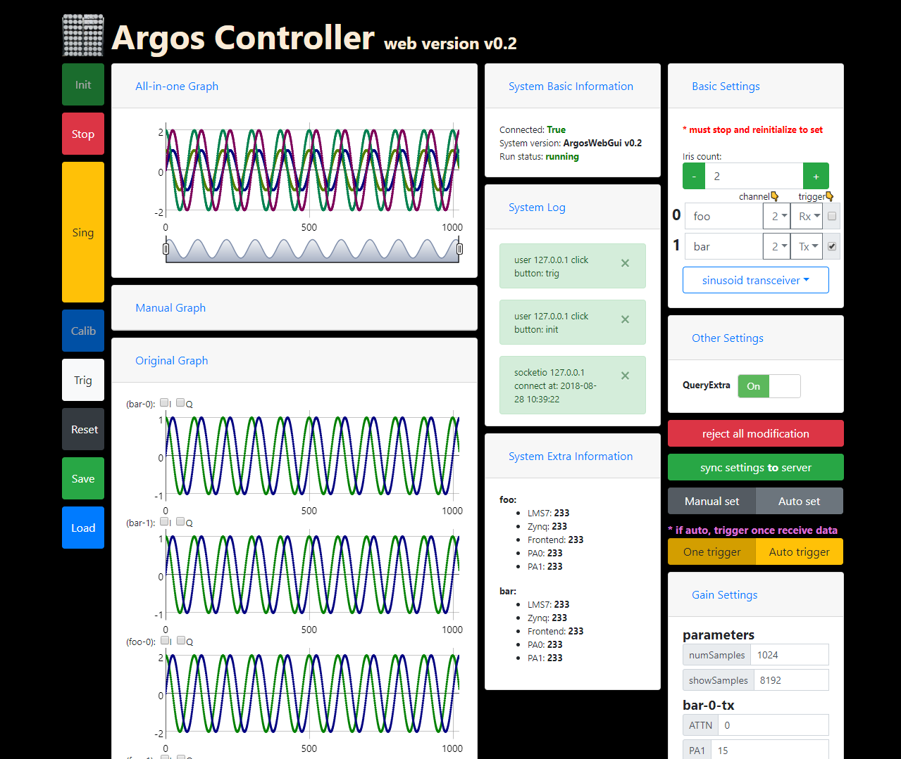

# ArgosWebGui

Web controller for Argos system, providing flexible and dynamic control to the system

**Warning: the webpage is written only to support Chrome. It has errors on Firefox but I don't fix it.**

## Dependencies

This project is **only** for [Skylark Wireless](http://www.skylarkwireless.com/) Iris board, the GitHub site is [here](https://github.com/skylarkwireless)

The SoapyIris dependency could be installed use this script: [install_soapy.sh](https://github.com/skylarkwireless/sklk-soapyiris/blob/master/utils/install_soapy.sh)


You need to install python3.x on your computer, then run command

```shell
python3 -m pip install -r requirement.txt
```

Then you can run `host.py` to start the web server

```shell
python3 host.py
```

it will then print the port information, which by default is `0.0.0.0:8080` public to other computer if your firewall allows. If you want to use it locally, modify the last few lines of `host.py`

```python
host = "0.0.0.0"
port = 8080
print("\n\n##############################################")
print("ArgosWebGui will run on port %d of '%s'" % (port, host))
print("##############################################\n\n")
socketio.run(app, host=host, port=port)
```

use `host = '127.0.0.1'` and `port = 80` then you can visit the GUI by `http://localhost/` in browser

## Demo

You can see demos [here](static/docs), for the basic one: [Sinusoid_Transceiver_DevFE_RevB_180828.html](static/docs/Sinusoid_Transceiver_DevFE_RevB_180828.html)

(the html might not be visible in GitHub, if you wanna have a look, [click here](static/docs/Sinusoid_Transceiver_DevFE_RevB_180828.md))

The v0.2 GUI is below, but it has been **out-of-date**, if you want to see the **latest one**, use link above



## TODO

1. HDF5 analyzer

## Feature

### 1. Left Button Bar

### 2. Graphs

### 3. System Information

### 4. Settings

