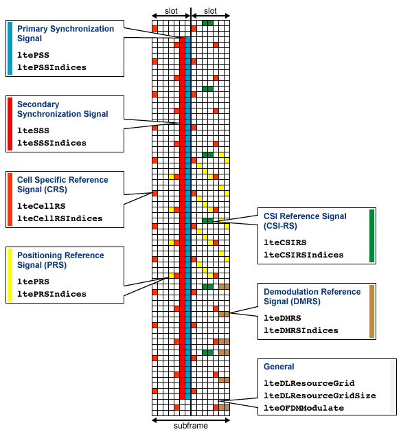

# LTE

## description

This experiment is for getting a glance on how LTE signals are sent and received on Iris board.

 The basic model is:

- Multiple Tx and Rx antennas are allowed, while at the same time, **only one tx** is activated
  - however, you can choose which one to activate during run-time
- The Tx antenna send **4096** samples **periodically**, which could be seen on GUI
  - Tx sample rate is 1.5MS/s (IQ sample), which occupies 3MHz bandwidth (LTE standard)
  - 15kHz subcarrier, there is 100 subcarriers, PSS and SSS will use the middle 62
  - I'm not sure how long the cyclic prefix are needed, just use $100\times10\%=10$ samples
  - each OFDM symbol occupies 110 samples, 1 subframe=1540 samples, only 2 subframe sent
  - LTE resource block occupies 12 subcarriers $\times$ 7 sample time, so there is $8\times4=32$ RB
  - The data is defined in `LTE_OneRepeator_SyncWatcher_DevFE_RevB_180902_Waveform.csv`
- All Receiver signals length are **configurable** during run-time, use **9MS/s sample rate**
  - use `SOAPY_SDR_HAS_TIME | SOAPY_SDR_END_BURST` flag, so you can adjust time alignment
  - the Tx period is $\frac{4096}{1.5\times 10^6}=2730667ns\approx 2.7ms$, however Rx with 40960 samples lasts $\frac{40960}{9\times 10^6}=4551111ns\approx 4.5ms$, you can set `offset` to adjust alignment
  - when your `offset` parameter is selected, which by default is 0, you trigger multiple time and will get the same wave form. This is expected as the clock rate error should be under 50ppm
- The hardware time use trigger to set 0 at initialization, so this is only **experimental scenario**
  - when applying for remote experiment, we could trigger once, then they should sync for a long time

[https://www.mathworks.com/help/lte/ref/downlink-physical-signals-grid.html](https://www.mathworks.com/help/lte/ref/downlink-physical-signals-grid.html)

## demos

