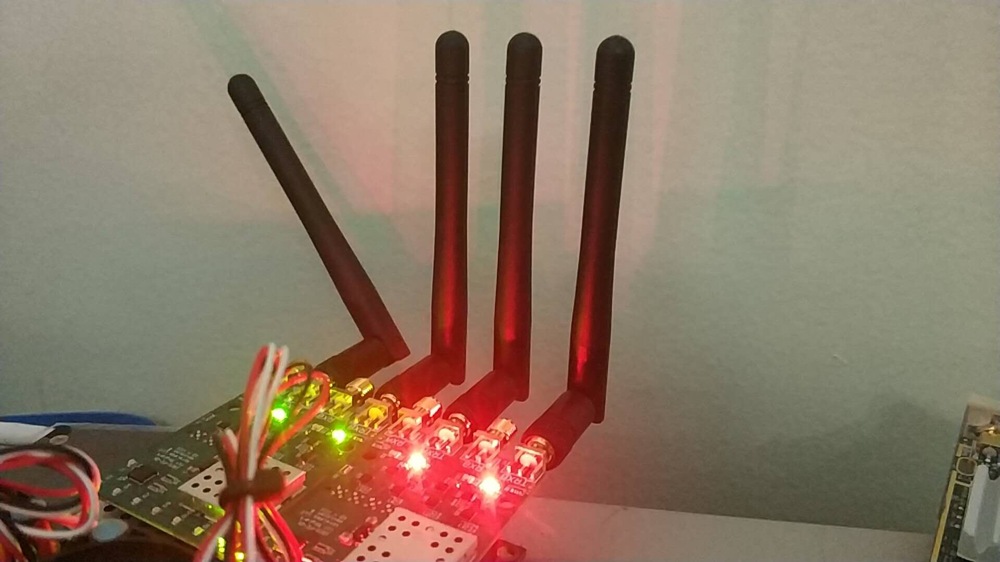
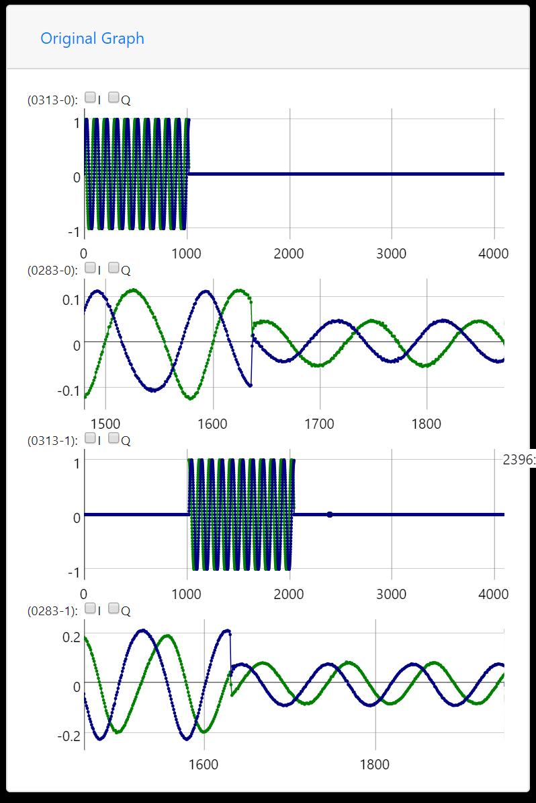
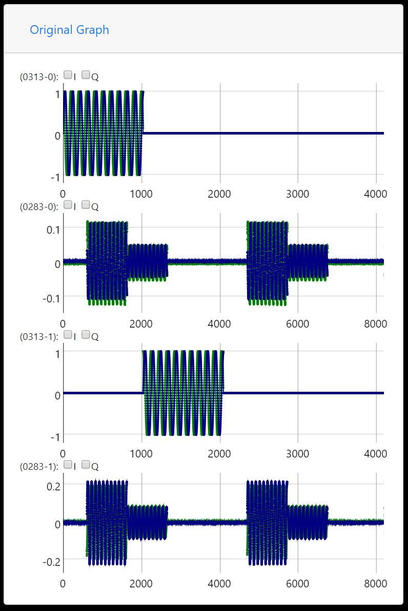

# Sinusoid_Repeator_DevFE_RevB_180830

Repeat a fixed wave for multiple Tx, cancel when closed.

## Functionality

- send sinusoid in one-hot mode, and blank sequence for another two `self.txFrameSize`
- you can add zero or more rx to see what happened simply

## demo

The red one is sender, while green one is receiver

the wave received is like this, very nice I think

