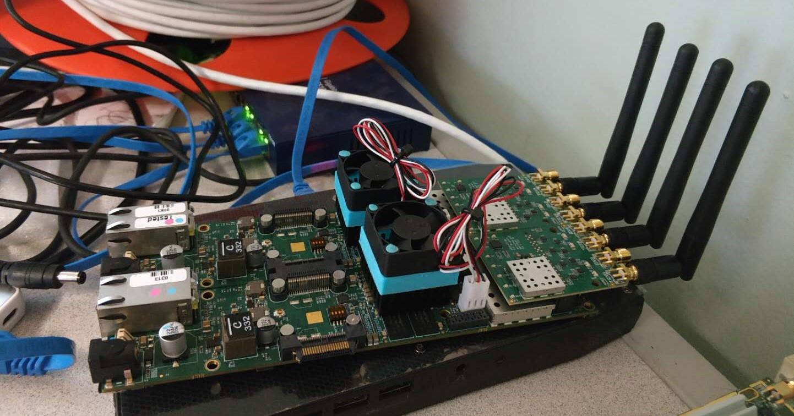

# Sinusoid_Transceiver_DevFE_RevB_180828

A copy from [Sinusoid_Transceiver_ArgosV2_180828](Sinusoid_Transceiver_ArgosV2_180828.html) with a little modification to work with revB devFE

## functionality

- same from [Sinusoid_Transceiver_ArgosV2_180828](Sinusoid_Transceiver_ArgosV2_180828.html)

## demo

### 1. the hardware

### 2. video demo: MIMO

if you cannot watch in this page, download [here](https://wuyue98.cn/pub/res/video180828ArgosWebGui.mp4)

<video controls="" preload="none" width="100%"><source id="mp4" src="https://wuyue98.cn/pub/res/video180828ArgosWebGui.mp4"  type="video/mp4"> </video>

